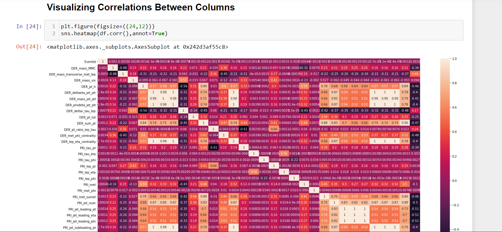
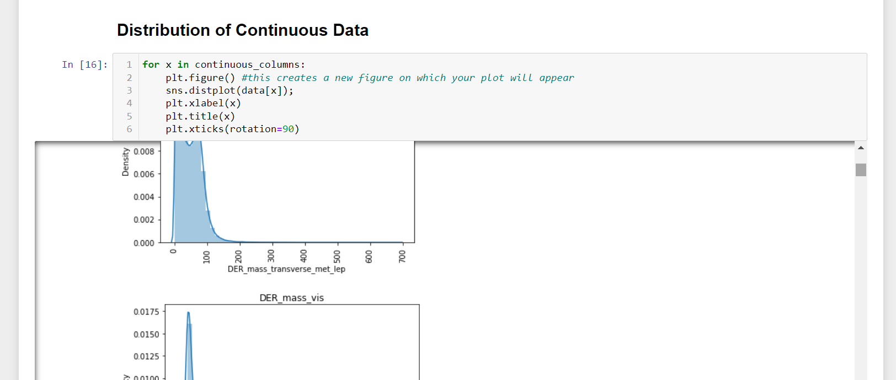
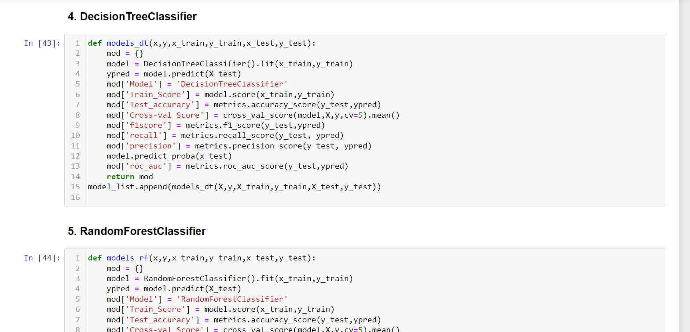

# Higgs Boson Prediction WebApp-with-Streamlit-and-Python 

## Web App Link - https://higgs-boson-prediction.herokuapp.com/ 

## Streamlit is an open-source app framework for Machine Learning and Data Science projects, Which helps you to view your projects in the Web Application.

## This is a classification problem to distinguish between a signal process which produces Higgs bosons and a background process which does not.

 
 
 

## To run in your local system, install the required packages from requirements.txt file.
